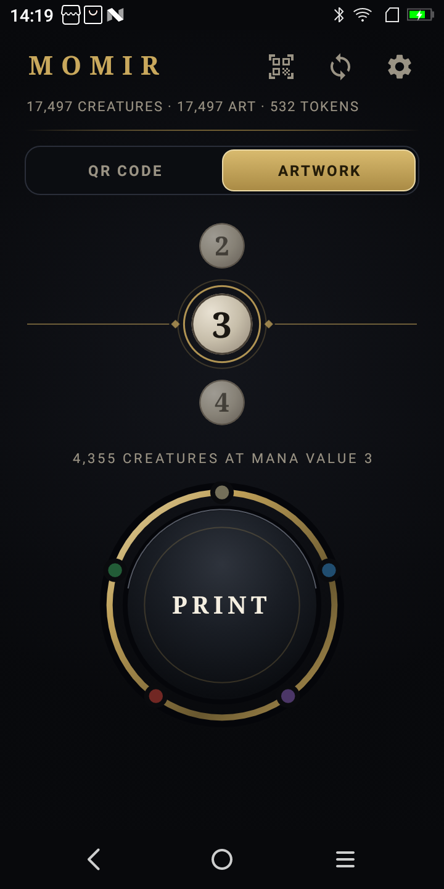
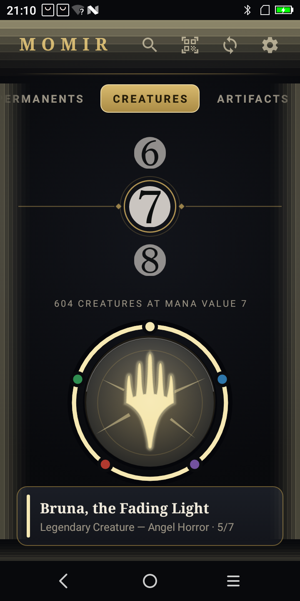
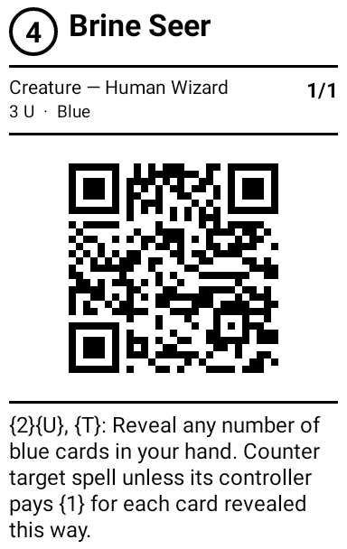
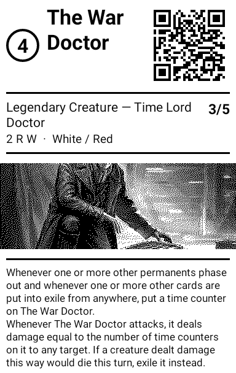

# MomirSunmi

A handheld Momir Basic machine. Spin the dial to a mana value, hit the big
button, and a receipt printer hands you a random creature card at that cost —
name, mana value, type line, power/toughness, full rules text, and either a QR
code to its Scryfall page or the actual artwork, dithered.

Everything runs offline on a **Sunmi V2** POS terminal. All 17,497 creatures
Magic has ever printed on paper live on the device, artwork included.

<p align="center">
  
  &nbsp;
  
  &nbsp;
  
  &nbsp;
  
</p>

## What is Momir Basic?

A Magic: The Gathering format built around one avatar ability:

> **{X}, Discard a card:** Create a token that's a copy of a randomly chosen
> creature card with mana value X. Activate only once each turn and only during
> your main phase.

Your deck is sixty basic lands. Every turn you pick a number, and the game hands
you a random creature. It is enormously fun and completely impractical without a
computer to do the rolling — which is what this is, except it also prints the
card so you have something to physically put on the battlefield.

## What it does

- **17,497 creatures**, every paper-legal creature card in Magic, with **17,497
  pre-dithered artworks** — 249 MB, entirely on-device.
- **Two print layouts.** Both carry name, mana value, type line, P/T and the
  complete rules text. One puts a large QR to the Scryfall page in the middle,
  the other puts the real artwork there and tucks a small QR into the header.
- **Tokens.** 1,976 of those creatures create something when they land — a
  Zombie, a Treasure, a Food. The app knows all **532** of them and prints them
  on demand.
- **Scan a slip.** Point the V2's camera at a QR on a slip you printed earlier
  and it resolves the card and offers to print its tokens. No network needed —
  the QR resolves against the local database.
- **Slips fit a sleeve, and they are all the same length.** A Magic card is
  63 × 88 mm, and every slip prints to exactly 88 mm — so a stack of them
  behaves like a stack of cards rather than a pile of receipts. The layout
  re-flows to fill or fit, whichever it needs.
- **It looks like something happened.** Pressing the button lights it up, the
  screen edge takes on the card's colour identity, and a band of that colour
  sweeps up and out of the top of the screen — which is where the V2's paper
  actually comes out. Multicolour cards run their colours around the border.
- **Resync.** With WiFi, the device pulls new cards straight from Scryfall and
  dithers their artwork itself. Without WiFi, nothing changes — everything works
  offline.

## There is no backend

Scryfall *is* the backend. Nothing in this project runs on a server:

- A one-off **build step on your PC** turns Scryfall's bulk export into
  `momir.db` and `art.pack`, which you push over adb.
- **Resync on the device** talks to `api.scryfall.com` directly.

The only thing static hosting would buy you is skipping the ~30-minute artwork
build when setting up a second device. It is not required.

## Getting started

You need a Sunmi V2 (or another Sunmi with the built-in 58 mm printer), Python
3.9+ with Pillow, a JDK 17+, and the Android SDK.

```bash
# 1. Build the corpus (about 35 minutes, most of it downloading artwork)
cd tools/momirdeck
pip install Pillow
python momirdeck.py build-db        # ~2 s   17,497 creatures
python momirdeck.py build-tokens    # ~1 min    532 tokens
python momirdeck.py build-art       # ~30 min   249 MB, resumable

# 2. Build and install the app
cd ../..
./gradlew :app:assembleDebug
adb install -r app/build/outputs/apk/debug/app-debug.apk

# 3. Push the corpus to the device
cd tools/momirdeck
python momirdeck.py push
```

Open the app. If the dial is populated and the header says "17,497 creatures",
you are done.

`build-art` is resumable — if it dies at card 9,000, run it again and it picks up
where it left off.

## Using it

| Action | What happens |
|---|---|
| Spin the dial | Pick a mana value. Only values that actually have creatures are offered — Magic has never printed one at mana value 14. |
| **PRINT** | Rolls a random creature at that mana value and prints it. |
| Long-press **PRINT** | Renders the slip to `preview.png` in the app's files directory *without* printing. For checking a layout without burning paper. |
| Tap "*n* tokens" | Lists what the creature creates; print one or all of them. |
| Scan button | Reads the QR off a slip and offers that card's tokens. |
| Settings → Test print | Prints a calibration slip for dialling in the tear-feed distance. |

### First-run calibration

The one setting worth getting right is **feed after printing** — how much paper
is pushed past the tear bar. It varies between units and paper rolls, and since
slip length is fixed, it is the number that decides whether 88 mm of slip
actually comes out as 88 mm of paper.

Print the test slip, tear it off, measure it, and adjust until the measured
length matches what the app reports. The default is 12 mm.

## Documentation

| | |
|---|---|
| [Architecture](docs/architecture.md) | How the pieces fit together and why |
| [Data pipeline](docs/data-pipeline.md) | Scryfall → SQLite → art pack, and exactly which cards count |
| [Printing](docs/printing.md) | The length budget, dithering, ESC/POS |
| [Sunmi AIDL](docs/sunmi-aidl.md) | Why this project only uses 21 of the printer service's methods |
| [Device setup](docs/device-setup.md) | Getting a V2 ready, adb, troubleshooting |

## Repository layout

```
app/                    Android app (Kotlin, minSdk 25, Views — no Compose)
  src/main/aidl/        Sunmi printer interface, trimmed to its stable prefix
  src/main/java/…/data      SQLite + art pack readers
  src/main/java/…/print     Slip layout, dithering, ESC/POS, printer binding
  src/main/java/…/sync      On-device Scryfall resync
  src/main/java/…/ui        The dial, the button, the scanner
tools/momirdeck/        The PC-side corpus builder
tools/make_icon.py      Regenerates the launcher icon
docs/                   The documents above
```

## Acknowledgements

Card data and artwork come from [Scryfall](https://scryfall.com), whose bulk
exports and API make a project like this a weekend rather than a year. Please
respect their [API guidelines](https://scryfall.com/docs/api) if you fork this —
the builder rate-limits itself to 10 requests per second and identifies itself,
and you should keep both.

Magic: The Gathering is a trademark of Wizards of the Coast. This is an
unofficial fan project with no affiliation, and it prints paper slips for
personal play, not card reproductions.

## License

MIT — see [LICENSE](LICENSE).
