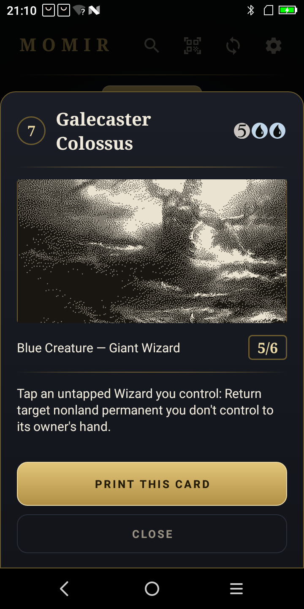
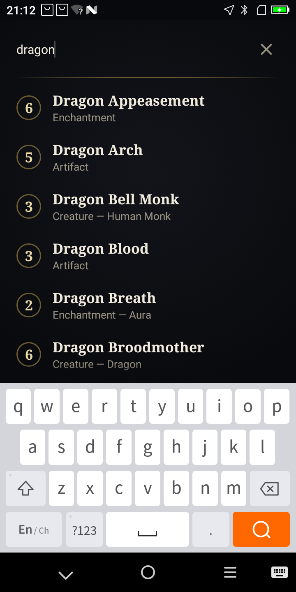

# MomirSunmi

A handheld Momir Basic machine. Pick a card type, spin the dial to a mana value,
press the button, and a receipt printer hands you a random card at that cost:
name, mana value, mana cost, type line, power/toughness or loyalty, the full
rules text, and either a QR code to its Scryfall page or the artwork, dithered.

It runs offline on a **Sunmi V2** POS terminal. All 30,423 rollable cards and
their artwork sit on the device.

<p align="center">
  
  &nbsp;
  
  &nbsp;
  
  &nbsp;
  
</p>

## What is Momir Basic?

A Magic: The Gathering format built on one avatar ability:

> **{X}, Discard a card:** Create a token that's a copy of a randomly chosen
> creature card with mana value X. Activate only once each turn and only during
> your main phase.

Your deck is sixty basic lands. Every turn you pick a number and the game gives
you a random creature at that cost. Playing it at a table needs something to do
the rolling, which is what this is. It also prints the card, so there is a piece
of cardboard to put on the battlefield.

The app rolls the other card types as well. The format does not ask for that,
but once the machine exists a random six-drop enchantment is one chip away.

## What it does

- **30,423 cards and 31,156 artworks, 427 MB on the device.** 17,497 creatures,
  3,620 instants, 3,562 enchantments, 3,507 artifacts, 3,385 sorceries, 287
  planeswalkers, 36 battles.
- **Six roll modes:** permanents, creatures, artifacts, enchantments,
  planeswalkers, spells. Every card carries one bit per type its type line
  names, so an artifact creature answers to a roll for either.
- **Two slip layouts.** Both print everything listed above. One fills the middle
  with a large QR to Scryfall; the other fills it with the artwork and sets a
  small QR into the picture's corner.
- **Every slip is 88 mm**, the long edge of a Magic card, margins included. A
  stack of them shuffles instead of behaving like a pile of receipts. The layout
  re-flows to fill or fit: reminder text goes before type is shrunk, and the
  artwork goes before any rules text is cut.
- **733 tokens.** 3,615 of the cards create something when they land, and those
  print too, in any quantity.
- **Card view.** Tapping the name on the result panel opens the card itself:
  artwork, mana cost and rules text in Magic's own symbols.
- **Search.** Any card by name, then print it.
- **Scan.** The V2's camera reads the QR off a slip you printed earlier and
  resolves it against the local database. No network involved.
- **Resync.** On WiFi the device fetches new cards from Scryfall and dithers
  their artwork itself. Without WiFi nothing changes.

The screen is dressed as a Magic card rather than as an Android app: warm
blacks, card-frame gold, a serif for anything that names a card, and Magic's own
mana symbols on the dial. The print button is a struck seal with the five
colours set into its rim. Pressing it lights the screen edge in the card's
colour identity and sweeps a band of it up towards the paper slot.

## There is no backend

Scryfall is the data source, and nothing in this project runs on a server:

- A one-off **build step on your PC** turns Scryfall's bulk export into
  `momir.db` and `art.pack`, which you push over adb.
- **Resync on the device** talks to `api.scryfall.com` directly.

Static hosting would only save you the artwork build when setting up a second
device.

## Getting started

You need a Sunmi V2 (or another Sunmi with the built-in 58 mm printer), Python
3.9+ with Pillow, a JDK 17 or 21, and the Android SDK.

```bash
# 1. Build the corpus (about an hour, most of it downloading artwork)
cd tools/momirdeck
pip install Pillow
python momirdeck.py build-db        # ~4 s     30,423 cards
python momirdeck.py build-tokens    # ~1 min      733 tokens
python momirdeck.py build-art       # ~50 min   407 MB, resumable

# 2. Build and install the app
cd ../..
./gradlew :app:assembleDebug
adb install -r app/build/outputs/apk/debug/app-debug.apk

# 3. Push the corpus to the device
cd tools/momirdeck
python momirdeck.py push
```

Open the app: if the dial is populated, you are done. Settings shows the full
diagnostics, including how many cards, artworks and tokens the device has.

`build-art` is resumable. If it dies at card 9,000, run it again and it picks up
where it left off.

## Using it

| Action | What happens |
|---|---|
| Pick a chip | Sets what the dial rolls. |
| Spin the dial | Sets the mana value. Only values that category has are offered. |
| **PRINT** | Rolls a card and prints it. |
| Long-press **PRINT** | Writes the slip to `preview.png` in the app's files directory instead of printing it. |
| Search (magnifier) | Finds a card by name. |
| Tap the card's name | Opens the card view: artwork, mana cost and rules text. |
| Tap "*n* tokens" | Opens the token sheet: pick one, set a quantity, print, or print one of each. |
| Scan button | Reads the QR off a printed slip and opens that card's tokens. |
| Settings → Test print | Prints a calibration slip. |

<p align="center">
  
  &nbsp;
  
  &nbsp;
  
</p>

### First-run calibration

The setting worth getting right is **head to tear bar**: the distance from the
print head to the bar you tear against. It varies between units and paper rolls,
and it does two jobs. It is fed after every slip so the finished slip reaches the
bar, and it is also the blank margin at the head, because that paper has already
passed the head when printing starts.

Print the test slip, tear it off, and measure the white band above the card name.
That is the number. The default is 12 mm; the layout gets what is left of the
88 mm after it and the 5 mm foot margin, which is 71 mm or 568 dots.

## Documentation

| | |
|---|---|
| [Architecture](docs/architecture.md) | How the pieces fit together and why |
| [Data pipeline](docs/data-pipeline.md) | Scryfall → SQLite → art pack, and which cards count |
| [Printing](docs/printing.md) | The length budget, dithering, ESC/POS |
| [Sunmi AIDL](docs/sunmi-aidl.md) | Why only 21 of the printer service's methods are used |
| [Device setup](docs/device-setup.md) | Getting a V2 ready, adb, troubleshooting |

## Repository layout

```
app/                    Android app (Kotlin, minSdk 25, Views, no Compose)
  src/main/aidl/        Sunmi printer interface, trimmed to its stable prefix
  src/main/java/…/data      SQLite + art pack readers
  src/main/java/…/print     Slip layout, dithering, ESC/POS, printer binding
  src/main/java/…/sync      On-device Scryfall resync
  src/main/java/…/ui        The dial, the button, the sheets, the scanner
tools/momirdeck/        The PC-side corpus builder
tools/make_icon.py      Regenerates the launcher icon from the print button
tools/mana_symbols.py   Rebuilds the mana symbols from Scryfall's SVGs
tools/dithercheck.py    Checks the device ditherer against the builder's
docs/                   The documents above
```

## Acknowledgements

Card data and artwork come from [Scryfall](https://scryfall.com). If you fork
this, please respect their [API guidelines](https://scryfall.com/docs/api): the
builder rate-limits itself to 10 requests per second and identifies itself, and
both are worth keeping.

Magic: The Gathering is a trademark of Wizards of the Coast. This is an
unofficial fan project with no affiliation. It prints paper slips for personal
play, not card reproductions.

## License

MIT, see [LICENSE](LICENSE).
