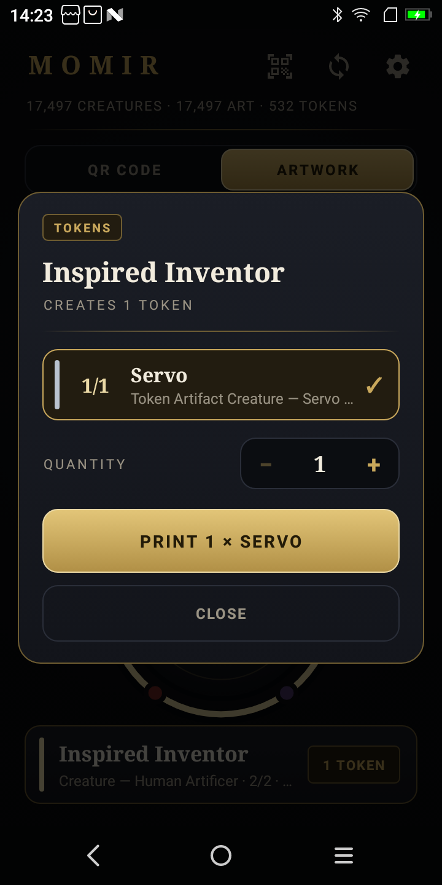

# MomirSunmi

A handheld Momir Basic machine. Pick what to roll, spin the dial to a mana
value, hit the big button, and a receipt printer hands you a random card at that
cost — name, mana value, type line, power/toughness or loyalty, full rules text,
and either a QR code to its Scryfall page or the actual artwork, dithered.

Everything runs offline on a **Sunmi V2** POS terminal. All 30,423 cards Magic
has printed on paper that are worth rolling live on the device, artwork
included.

<p align="center">
  
  &nbsp;
  
  &nbsp;
  
  &nbsp;
  
</p>

## What is Momir Basic?

A Magic: The Gathering format built around one avatar ability:

> **{X}, Discard a card:** Create a token that's a copy of a randomly chosen
> creature card with mana value X. Activate only once each turn and only during
> your main phase.

Your deck is sixty basic lands. Every turn you pick a number, and the game hands
you a random creature. It is enormously fun and completely impractical without a
computer to do the rolling — which is what this is, except it also prints the
card so you have something to physically put on the battlefield.

The app rolls the other card types too, which the format does not ask for. Once
the machine exists, "a random six-drop enchantment" is a chip and a press away,
and a table that has played Momir for an evening will invent a variant that
wants one.

## What it does

- **30,423 cards** with **31,156 pre-dithered artworks** — 427 MB, entirely
  on-device. 17,497 creatures, 3,620 instants, 3,562 enchantments, 3,507
  artifacts, 3,385 sorceries, 287 planeswalkers, 36 battles.
- **Roll more than creatures.** A chip row above the dial picks permanents in
  general, or creatures, artifacts, enchantments, planeswalkers or spells
  specifically. Every card carries one bit per type its type line names, so an
  artifact creature answers to a roll for either — which is correct, it is both.
- **Two print layouts.** Both carry name, mana value, type line, P/T or loyalty
  and the complete rules text. One puts a large QR to the Scryfall page in the
  middle; the other puts the real artwork there and sets a small QR into the
  picture's corner, where it costs no length at all.
- **Tokens.** 3,615 of those cards create something when they land — a Zombie, a
  Treasure, a Food. The app knows all **733** of them and prints them on
  demand.
- **Scan a slip.** Point the V2's camera at a QR on a slip you printed earlier
  and it resolves the card and offers to print its tokens. No network needed —
  the QR resolves against the local database.
- **Slips fit a sleeve, and they are all the same length.** A Magic card is
  63 × 88 mm, and every slip prints to exactly 88 mm, margins included — so a
  stack of them behaves like a stack of cards rather than a pile of receipts.
  The layout re-flows to fill or fit, whichever it needs, dropping reminder text
  before it shrinks type and never setting anything below 20 dots.
- **Read the card, not just the slip.** Tapping the name on the result panel
  opens the card itself: the artwork on a paper-coloured window, the mana cost
  and rules text in real Magic symbols, laid out in the order a card is.
- **Search.** The dial rolls, but sooner or later you want a particular card —
  the token an opponent just made, a Sol Ring for the pile. Type a name, look at
  what you found, print it.
- **It looks like Magic.** The dial spins Magic's own mana symbols — Scryfall's
  artwork, converted to vector drawables and shipped in the APK, because a device
  with no network still has to draw them. The print button is a brass seal with
  the five colours set into its rim as gems — WUBRG clockwise, the colour wheel —
  and everything that names a card is set in a serif on card-frame gold.
- **It looks like something happened.** Pressing the button lights it up, the
  screen edge takes on the card's colour identity, and a band of that colour
  sweeps up and out of the top of the screen — which is where the V2's paper
  actually comes out. Multicolour cards run their colours around the border, and
  the button keeps the creature's colours until the result clears.
- **Resync.** With WiFi, the device pulls new cards straight from Scryfall and
  dithers their artwork itself. Without WiFi, nothing changes — everything works
  offline.

## There is no backend

Scryfall *is* the backend. Nothing in this project runs on a server:

- A one-off **build step on your PC** turns Scryfall's bulk export into
  `momir.db` and `art.pack`, which you push over adb.
- **Resync on the device** talks to `api.scryfall.com` directly.

The only thing static hosting would buy you is skipping the ~30-minute artwork
build when setting up a second device. It is not required.

## Getting started

You need a Sunmi V2 (or another Sunmi with the built-in 58 mm printer), Python
3.9+ with Pillow, a JDK 17+, and the Android SDK.

```bash
# 1. Build the corpus (about an hour, most of it downloading artwork)
cd tools/momirdeck
pip install Pillow
python momirdeck.py build-db        # ~4 s     30,423 cards
python momirdeck.py build-tokens    # ~1 min      733 tokens
python momirdeck.py build-art       # ~50 min   407 MB, resumable

# 2. Build and install the app
cd ../..
./gradlew :app:assembleDebug
adb install -r app/build/outputs/apk/debug/app-debug.apk

# 3. Push the corpus to the device
cd tools/momirdeck
python momirdeck.py push
```

Open the app. If the dial is populated and the line under it counts cards, you
are done. Settings carries the full diagnostics: what the printer reports about
itself, and how many cards, artworks and tokens are on the device.

`build-art` is resumable — if it dies at card 9,000, run it again and it picks up
where it left off.

## Using it

| Action | What happens |
|---|---|
| Pick a chip | What the dial rolls: permanents, creatures, artifacts, enchantments, planeswalkers or spells. |
| Spin the dial | Pick a mana value. Only values that category actually has are offered — Magic has never printed a creature at mana value 14, and planeswalkers start at 2. |
| **PRINT** | Rolls a random card of that type at that mana value and prints it. |
| Long-press **PRINT** | Renders the slip to `preview.png` in the app's files directory *without* printing. For checking a layout without burning paper. |
| Search (magnifier) | Find any of the 30,423 by name and print it. The dial rolls; sooner or later you want *this* card. |
| Tap the card's name | Opens the card itself: artwork, mana cost and rules text in real Magic symbols, laid out the way a card is. The slip is 48 mm wide and usually across the table by the time someone wants to re-read an ability off it. |
| Tap "*n* tokens" | Opens the token sheet: pick one, set a quantity, print — or print one of each. |
| Scan button | Reads the QR off a slip and opens that card's token sheet, stamped as a scan. |
| Settings → Test print | Prints a calibration slip for dialling in the paper geometry. |

<p align="center">
  
</p>

<p align="center">
  <sub>The token sheet, however it was opened — it says which of the two it was.</sub>
</p>

### First-run calibration

The one setting worth getting right is **head to tear bar** — the distance from
the print head to the bar you tear against. It varies between units and paper
rolls, and it is spent twice: it is fed after every slip so the slip clears the
bar, and it is also the blank margin at the head, because that paper is already
past the head when printing starts and can never be printed on.

Print the test slip, tear it off, and measure the white band above the card
name. That is the number. The default is 12 mm, and the layout gets whatever is
left of the 88 mm after it and the 5 mm foot margin — 71 mm, or 568 dots.

## Documentation

| | |
|---|---|
| [Architecture](docs/architecture.md) | How the pieces fit together and why |
| [Data pipeline](docs/data-pipeline.md) | Scryfall → SQLite → art pack, and exactly which cards count |
| [Printing](docs/printing.md) | The length budget, dithering, ESC/POS |
| [Sunmi AIDL](docs/sunmi-aidl.md) | Why this project only uses 21 of the printer service's methods |
| [Device setup](docs/device-setup.md) | Getting a V2 ready, adb, troubleshooting |

## Repository layout

```
app/                    Android app (Kotlin, minSdk 25, Views — no Compose)
  src/main/aidl/        Sunmi printer interface, trimmed to its stable prefix
  src/main/java/…/data      SQLite + art pack readers
  src/main/java/…/print     Slip layout, dithering, ESC/POS, printer binding
  src/main/java/…/sync      On-device Scryfall resync
  src/main/java/…/ui        The dial, the button, the token sheet, the scanner
tools/momirdeck/        The PC-side corpus builder
tools/make_icon.py      Regenerates the launcher icon from the print button
tools/mana_symbols.py   Rebuilds the mana symbols from Scryfall's SVGs
tools/dithercheck.py    Checks the device ditherer against the builder's
docs/                   The documents above
```

## Acknowledgements

Card data and artwork come from [Scryfall](https://scryfall.com), whose bulk
exports and API make a project like this a weekend rather than a year. Please
respect their [API guidelines](https://scryfall.com/docs/api) if you fork this —
the builder rate-limits itself to 10 requests per second and identifies itself,
and you should keep both.

Magic: The Gathering is a trademark of Wizards of the Coast. This is an
unofficial fan project with no affiliation, and it prints paper slips for
personal play, not card reproductions.

## License

MIT — see [LICENSE](LICENSE).
