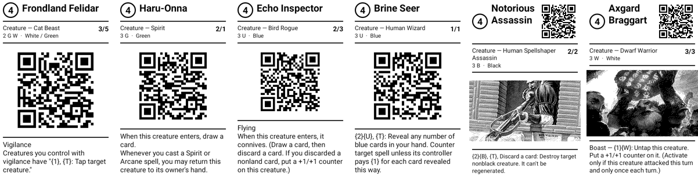

# Printing

Everything between "a card was rolled" and "paper comes out".

## Every slip is the same length

This is the constraint the whole layout is built around.

A printed slip has to slide into a normal Magic sleeve, so it must be no longer
than a real card: **63 × 88 mm**. And it is not merely *allowed* to be 88 mm —
every slip is printed to exactly that, whatever the card. Uniform slips stack,
fan and shuffle like cards. Slips whose length tracks how much rules text a
creature happens to have stack like receipts.

Width is not a problem. The V2 prints 58 mm paper at 203 dpi with 384 printable
dots, which is 48 mm — comfortably inside 63 mm.

Length is the interesting one. At 8 dots/mm the whole slip is **704 dots**, and
part of that is spent feeding the paper past the tear bar, which sits roughly
12 mm above the print head:

```
88 mm slip length           704 dots
− 12 mm tear feed         −  96 dots
────────────────────────────────────
  76 mm of layout           608 dots   ← every slip, exactly
```

Both numbers are settings, because the tear-bar distance varies between units
and paper rolls. Settings → Test print produces a calibration slip: tear it off,
measure it, adjust until the measured length matches what the app reports.

So the renderer has two problems, not one: cards that want more than 608 dots,
and cards that want less.



## When a card wants less

A vanilla 3/3 with one line of rules text leaves a lot of paper unaccounted for.
Leaving it blank at the bottom would read as a mistake rather than as layout, so
the slack is spent instead:

1. **The QR grows.** In QR mode the code is sized against what is actually left
   after the text, up to 9 dots per module, where a 33-module symbol stops
   fitting across 364 dots. A bigger code also scans better, so this is free in
   both directions.
2. **What remains pads the picture**, split evenly above and below. The image
   ends up optically centred between the type line and the rules text.

Artwork cannot grow — it is stored at 384 dots wide and blitted 1:1, and
upscaling would destroy the dithering — so artwork slips lean on step 2.

## When a card wants more

Eldrazi with six keywords do not fit in 608 dots. The renderer does **not**
scale the layout down — scaling would resample the artwork and destroy the
dithering that took 29 minutes to compute.

Instead it walks a fixed ladder of compromises, least destructive first, and
takes the first rung that fits:

| Rung | Rules text | Artwork |
|---:|---:|---:|
| 1 | 24 px | 100 % |
| 2 | 24 px | 92 % |
| 3 | 22 px | 92 % |
| 4 | 22 px | 82 % |
| … | … | … |
| 9 | 17 px | 50 % |

Text gives ground first: dropping the rules text one point is barely visible,
cropping the artwork is. Cropping takes rows off the top and bottom evenly so
the subject stays centred, and — crucially — keeps the pixel grid 1:1.

If nothing on the ladder fits, the last rung is taken and the rules text is
ellipsised into whatever vertical space remains.

`Raster` always comes back at exactly the configured length — measured across a
sample of both modes: 608 dots, 88.0 mm, every time.

## Layout

Both modes print name, mana value, type line, power/toughness and the complete
rules text. The mode only decides what fills the middle.

```
QR mode                          Artwork mode
┌──────────────────────────┐     ┌──────────────────────────┐
│ (3)  Blood-Cursed        │     │ (3)  Timmerian     ▓▓▓▓  │  ← small QR
│      Knight              │     │      Fiends        ▓▓▓▓  │
├──────────────────────────┤     ├──────────────────────────┤
│ Creature — Vampire  3/2  │     │ Creature — Horror   1/1  │
│ 1 W B · White / Black    │     │ 1 B B · Black            │  ← cost and colour
├──────────────────────────┤     ├──────────────────────────┤
│      ▓▓▓▓▓▓▓▓▓▓▓         │     │                          │
│      ▓▓ large QR ▓       │     │      dithered artwork    │
│      ▓▓▓▓▓▓▓▓▓▓▓         │     │                          │
├──────────────────────────┤     ├──────────────────────────┤
│ As long as you control   │     │ Remove this card from    │
│ an enchantment…          │     │ your deck before…        │
└──────────────────────────┘     └──────────────────────────┘
```

The mana value badge is an **outlined ring, not a filled disc**. A solid 54-dot
circle dumps a lot of heat into one spot and bleeds on cheap paper.

### The colour line

A thermal slip is monochrome, so nothing on the paper tells you what colour the
creature is. Usually the mana cost gives it away, but not always — a Devoid
creature is colourless despite a coloured cost, Stonecoil Serpent costs `{X}`
and is colourless, and Kobolds of Kher Keep has no mana cost at all and is red.
Since Momir hands you a *token copy* of the card, and colour decides what can
target it, the slip spells it out.

Colours are named for one to three of them ("White / Black") and shortened to
letters for four or five, because "White / Blue / Black / Red / Green" is
thirty-five characters and anyone holding a five-colour creature can read WUBRG.

That line runs the **full width, under the type line**, rather than under the
card name. In artwork mode the title column is only about 170 dots wide once the
badge and the QR have taken their share, and Reaper King's
`2/W 2/U 2/B 2/R 2/G` does not fit in that at any size worth reading — it used
to run underneath the QR and get clipped.

### Why artwork slips still carry a QR

The scanner resolves a slip back to its card by reading that QR, which is what
makes "which tokens does this make" work at the table. An artwork slip without
one would be a dead end.

It goes in the header rather than under the rules text. Beside the name it costs
about 2 mm of length; below the text it would cost 14 mm and force the artwork
to be cropped to pay for it.

### Shortening the URL

Slips encode `https://scryfall.com/card/ltc/22`, not the full
`https://scryfall.com/card/ltc/22/monstrosity-of-the-lake`. Scryfall resolves set
plus collector number on its own.

That drops a typical URL from 44 bytes to 32, which is the difference between a
**version 4 QR (33 modules)** and a **version 3 one (29 modules)**. In the header
that is what leaves enough width for the card name — at 33 modules the title
column got so narrow that "Windreaver" broke across two lines mid-word.

The scanner handles the mismatch: the corpus stores Scryfall's full URL, so a
scanned short URL is matched as an indexed prefix.

### QR sizing

Modules are drawn as an exact integer number of dots, always. That is why the
code uses ZXing's low-level `Encoder` rather than `QRCodeWriter` — the latter
resamples to a requested pixel size, so module edges land mid-dot and the code
comes out fuzzy.

| | Modules | Dot size | Why |
|---|---:|---:|---|
| Header QR | 4 | 0.5 mm | The size a QR on a business card uses. 3 fits more comfortably but thermal dots bleed into their neighbours, and 0.375 mm modules start closing the gaps a decoder needs. |
| Body QR | 4–9 | 0.5–1.1 mm | Grows into whatever the rules text leaves. Width caps it at 9. |

Error correction is **M (15 %)**. Slips get thumbed, folded and left in sleeves;
L is smaller but does not survive a smudge across a timing pattern.

## Dithering

Thermal paper has no midtones. Every artwork is reduced to pure black and white
once, on the PC, and stored that way:

1. Decode the Scryfall `art_crop` (about 616 × 452).
2. Resize to 384 px wide with Lanczos.
3. Centre-crop to at most 300 dots tall.
4. Autocontrast, gamma 0.85, contrast 1.25 — a flat original turns to mud
   without the lift, and a dark one turns into a solid brick that soaks the paper.
5. **Floyd–Steinberg** to 1 bit.
6. Pack MSB-first, invert so 1 = burn.

Floyd–Steinberg holds far more detail than a plain threshold; at 384 dots wide
you can still read a creature's silhouette and often its face.

The on-device resync repeats these exact steps in Kotlin, with the same
parameters, so artwork pulled over WiFi is indistinguishable from artwork built
on a PC. If the two drifted, a deck built before a resync and one built after
would print at visibly different densities.

## Compositing and thresholding

The slip is drawn on an `ARGB_8888` canvas at 384 × N, then converted to 1 bpp
with a **plain threshold at 170** — deliberately above the midpoint.

This works because the two kinds of content have different needs and the same
answer:

- Artwork is already pure black and white, so *any* threshold reproduces it
  bit-for-bit. It is blitted at exactly 1:1, no scaling and no filtering.
- Text and QR modules are the only antialiased things on the canvas. Biasing the
  cut above the midpoint keeps thin stems solid instead of letting them dissolve
  into grey that rounds to white. On paper that is the difference between
  legible and not.

Rendering type on a Canvas rather than sending it as text also sidesteps ESC/POS
code pages entirely — which matters when your corpus contains "Æther Vial",
"Jötun Grunt", "Lim-Dûl's Vault" and "Asmoranomardicadaistinaculdacar".

## ESC/POS

One `sendRAWData` call per slip carries the whole job:

```
ESC @            reset alignment, spacing, leftover state
ESC a 0          align left
GS v 0 …         raster bit image, in 128-row bands
ESC J n          feed n dots, repeated for n > 255
```

`GS v 0` is split into bands because some firmware revisions dislike a single
enormous raster command, and a short band lets the motor keep up with the head.
Bands print flush against each other, so the seam is invisible.

The whole payload is roughly 30 KB — nowhere near the 1 MB Binder ceiling — and
sending it as one transaction means the printer cannot interleave anything
between the image and its feed.

The SDK's own `printBitmap` is not used: it re-binarises whatever it is given,
which would undo the dithering. `printText` is not used either, for the code page
reason above. See [sunmi-aidl.md](sunmi-aidl.md).

## Checking a layout without printing

Long-press the **PRINT** button. It rolls a creature, renders the slip, and
writes it to `preview.png` in the app's external files directory instead of
printing:

```bash
adb pull /sdcard/Android/data/software.zeasy.momir/files/preview.png
```

Every slip image in this documentation was produced that way. It is also how the
two layout bugs described above — the clipped mana cost and the broken word —
were caught, without a metre of wasted paper.
